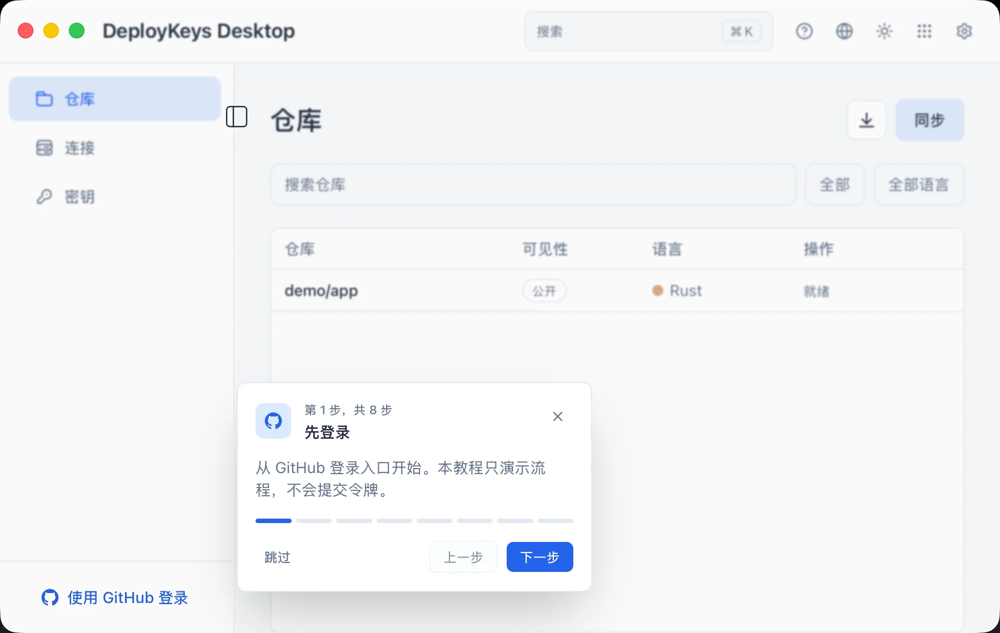
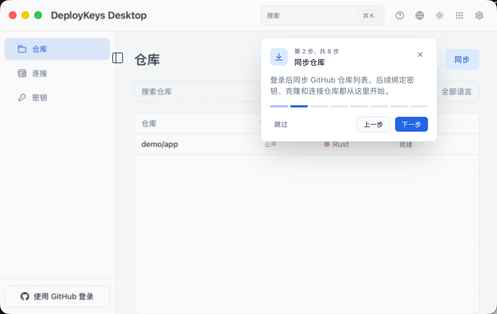
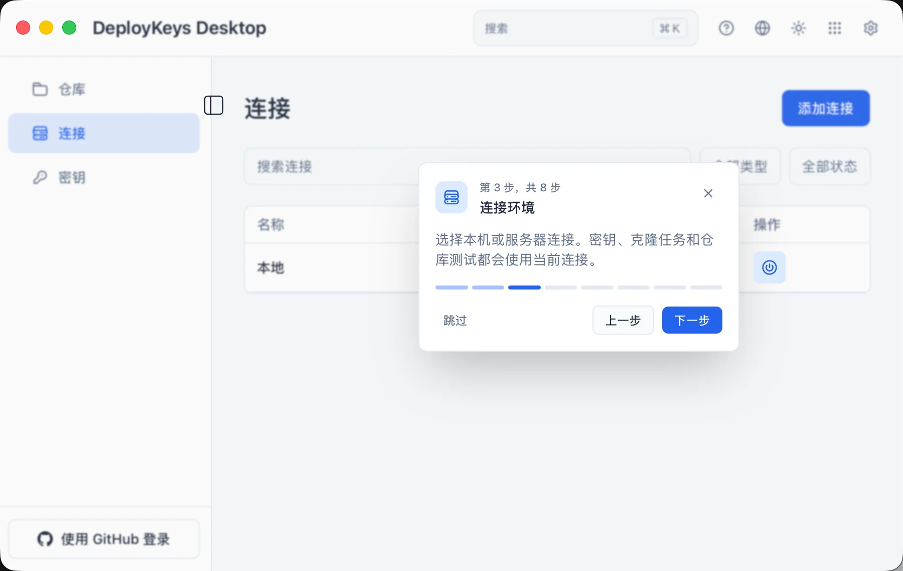
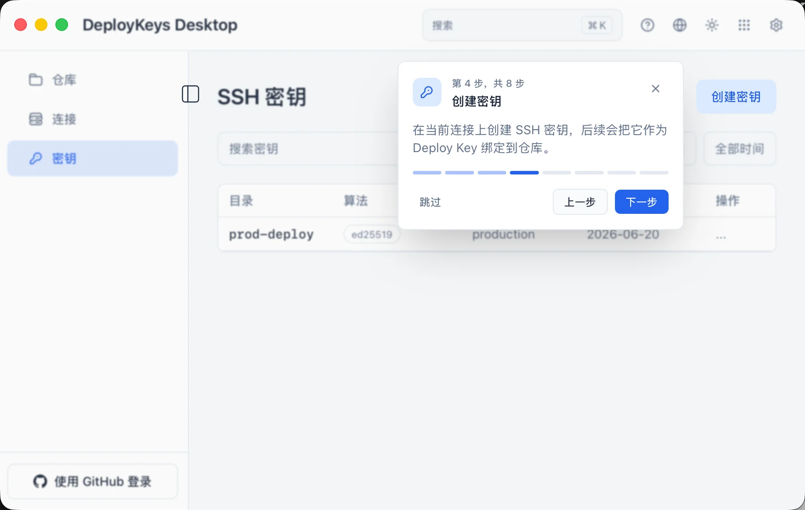
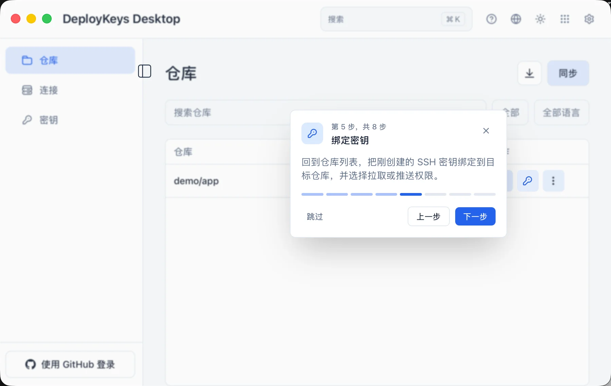
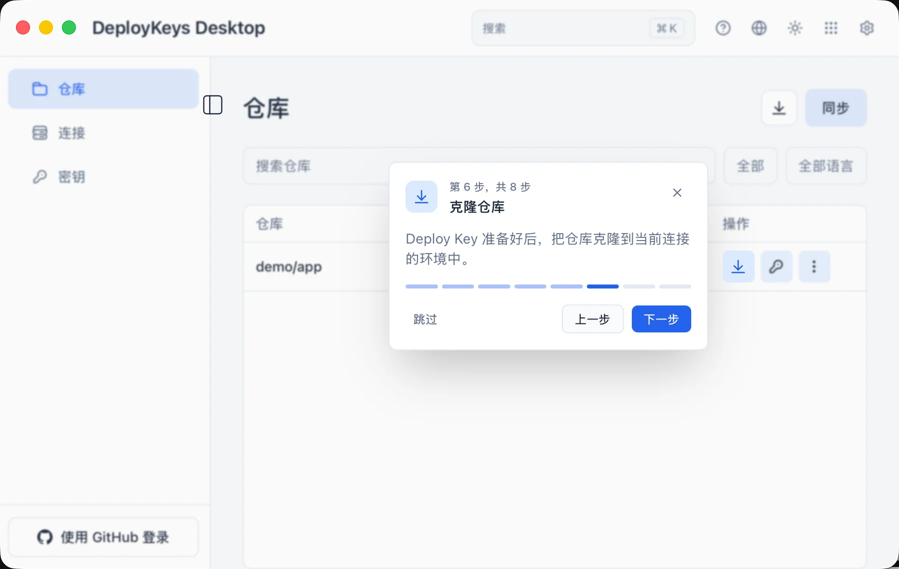
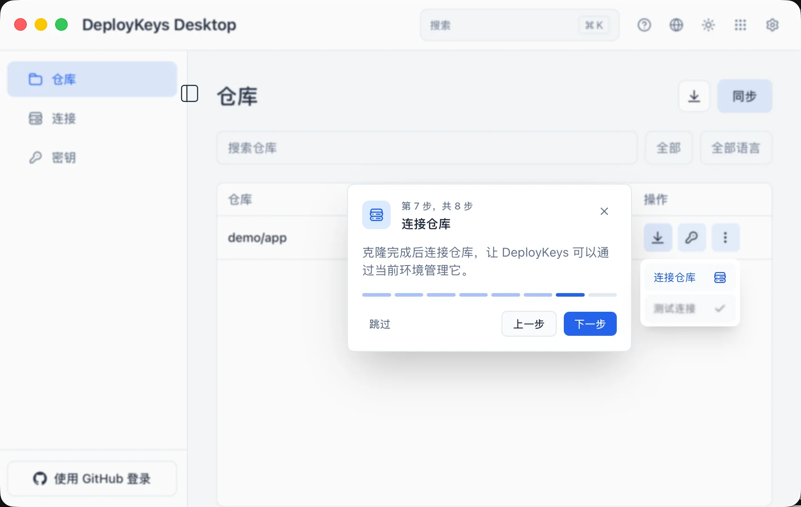
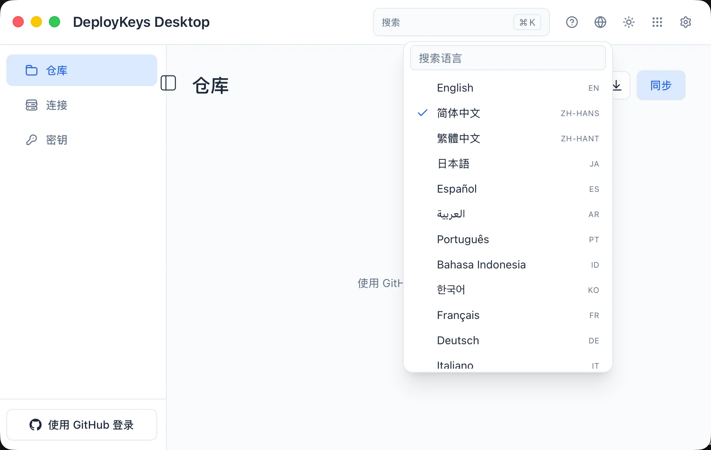

<h1 align="center">DeployKeys Desktop</h1>

<p align="center">
  <a href="README.md">English</a> | 简体中文
</p>

<p align="center">
  <a href="LICENSE"></a>
  <a href="https://www.rust-lang.org"></a>
</p>

DeployKeys Desktop 是一个面向 GitHub Deploy Keys 的桌面管理工具。它以“目标环境”为核心：你可以在本机或远端服务器上生成 SSH 密钥，把公钥绑定到 GitHub 仓库，并在对应环境中完成 clone、remote 配置和连通性测试。

项目当前由 Rust 原生核心、Tauri 2 桌面宿主和 Leptos/wasm 前端组成，重点解决多仓库、多部署环境下 Deploy Key 分散、私钥位置不清、绑定状态难验证的问题。

## 相关页面

### 帮助指引










### 国际化语言



## 功能特性

### GitHub 账号与仓库同步

- 使用 GitHub fine-grained Personal Access Token 登录。
- 登录时通过 GitHub `/user` 校验 token，并把 token 引用持久化到本地数据库。
- 同步当前账号可访问的仓库列表。
- 仓库表支持搜索、公开/私有过滤、语言过滤、分页和刷新。

### 目标环境管理

- 内置本机连接。
- 支持添加远端 SSH 服务器连接。
- 远端连接支持密码或 SSH 私钥认证。
- 可测试远端连接，检测目标环境是否可用并确认 `ssh-keygen`。
- 连接记录可编辑、删除，当前激活连接会影响密钥、clone 和仓库测试操作。

### SSH 密钥管理

- 在当前激活环境生成 SSH key pair。
- 本机密钥由 Rust 原生生成；远端密钥通过目标服务器上的 `ssh-keygen` 生成。
- 当前 UI 支持 Ed25519、RSA 2048、RSA 4096，其中 Ed25519 为推荐选项。
- 私钥保存在目标环境的密钥目录中，远端私钥不会回传到本机。
- 密钥列表支持搜索、算法过滤、创建时间过滤、排序和分页。
- 支持复制公钥、编辑目录/备注、删除密钥及其文件。
- 默认本机密钥目录为 `~/.ssh/deploykeys`，可在设置中修改；已有密钥不会被自动迁移。

### Deploy Key 绑定与仓库操作

- 可将已有 SSH 公钥绑定为目标 GitHub 仓库的 Deploy Key。
- 支持 Pull 或 Push 权限，部署场景推荐使用 Pull。
- 绑定后会为仓库写入独立 SSH config host alias，避免污染普通 `github.com` SSH 配置。
- 可 clone 仓库到本机或远端服务器。
- clone 任务持久化保存，支持查看运行状态和终端输出日志。
- 可把已 clone 的仓库 remote 连接到 DeployKeys 管理的 SSH host alias。
- 可测试仓库 SSH 连通性，验证路径、私钥和 GitHub Deploy Key 是否匹配。

### 设置、体验与国际化

- 支持系统/浅色/深色主题。
- 支持可搜索的命令面板。
- 支持新手引导流程。
- 支持仓库、连接、密钥列表的统一分页大小设置。
- UI 内置 31 种语言，支持运行时切换。
- Arabic 会自动切换为 RTL 布局，其他语言使用 LTR。

## 安全模型

- 发布构建默认使用系统凭据存储：
  - macOS: Keychain
  - Linux: Secret Service / libsecret
- SQLite 数据库只保存 token 或密码的引用键，不保存明文 GitHub token。
- Debug 构建默认使用文件凭据后端，避免 macOS 开发签名反复触发 Keychain 提示；可设置 `DEPLOYKEYS_CREDENTIALS_BACKEND=keychain` 强制使用系统 keychain。
- 远端服务器密码会通过凭据存储保存；SSH 私钥认证只保存私钥文件路径。
- 远端目标生成的私钥留在远端服务器。
- 本机私钥目录权限会尽量设置为 `0700`，私钥文件由生成器以受限权限写入。
- 应用只写入自己管理的 SSH config block，不会整体接管 `~/.ssh/config` 或 `~/.gitconfig`。
- 日志清理逻辑会遮蔽 GitHub token、认证头、JSON token 字段和常见密码字段。

## GitHub Token 权限

登录页使用 fine-grained Personal Access Token。创建 token 时建议：

- Resource owner: 选择个人账号或组织。
- Repository access: 选择需要管理 Deploy Key 的仓库。
- Permissions:
  - Administration: Read and write
  - Metadata: Read

`Administration: Read and write` 用于创建和管理仓库 Deploy Keys，`Metadata: Read` 用于读取仓库基础信息。

## 系统要求

- Rust 1.75+
- macOS 10.15+ 或 Linux x86_64/arm64
- Git 和 OpenSSH 客户端
- `sqlite3` CLI，用于创建 SQLx 编译期检查数据库
- `wasm32-unknown-unknown` target
- Trunk
- Tauri CLI v2

远端服务器如果用于生成密钥或 clone 仓库，还需要：

- SSH 可访问
- `ssh-keygen`
- `git`
- 能通过 SSH 访问 GitHub

## 快速开始

```bash
git clone <repository-url>
cd deploykeys-desktop

rustup target add wasm32-unknown-unknown
cargo install trunk
cargo install tauri-cli --version "^2"

# 安装 Tailwind standalone CLI。若 tools/tailwindcss 已存在且校验通过，可跳过。
tools/install-tailwind.sh

# 创建 SQLx 编译期检查数据库；如果 .env 不存在，会从 .env.example 复制。
make db-setup

# 启动 Tauri + Trunk 开发环境。
make run
```

Tauri 会启动 `crates/deploykeys-ui` 的 Trunk dev server，并打开桌面窗口。前端 dev server 默认端口为 `8000`。

## 常用命令

```bash
make run        # 启动开发桌面应用
make build      # 打包 release 桌面应用
make dev        # 构建 native crates，不构建 wasm UI
make ui-build   # 使用 Trunk 构建 Leptos/wasm 前端
make test       # 运行 native crates 测试
make fmt        # 格式化代码
make clippy     # Clippy，警告视为错误
make check      # fmt + clippy + test
make audit      # cargo audit
make db-setup   # 重建 deploykeys.db，用于 SQLx 编译期检查
make db-clean   # 删除 SQLx 编译期检查数据库
make watch      # native crates 的 clippy/test watch 循环
```

## 项目结构

```text
deploykeys-desktop/
├── crates/
│   ├── deploykeys-core/      # 核心业务逻辑：GitHub、数据库、密钥、目标环境、SSH
│   ├── deploykeys-app/       # Tauri 2 原生宿主与 IPC 命令
│   └── deploykeys-ui/        # Leptos CSR 前端，Trunk 构建到 wasm
├── migrations/               # SQLite migrations
├── tools/                    # Tailwind standalone CLI 安装脚本
├── Makefile                  # 本地开发命令
├── README.md                 # 英文文档
└── README-zh-CN.md           # 简体中文文档
```

根 workspace 的 `default-members` 只包含 `deploykeys-core` 和 `deploykeys-app`。因此在仓库根目录直接运行 `cargo build` 或 `cargo test` 时，只会处理原生 crates；wasm-only 的 UI crate 由 Trunk/Tauri 构建流程处理。

## 架构说明

- `deploykeys-core` 不依赖 UI，负责数据库、GitHub API、凭据存储、密钥生成、SSH 远端命令、Deploy Key 绑定和验证。
- `deploykeys-app` 打开应用数据目录下的 SQLite 数据库，运行 migrations，并通过 Tauri IPC 暴露命令给前端。
- `deploykeys-ui` 是 Leptos CSR 应用，只调用 IPC DTO，不直接访问核心模型或秘密信息。
- 密钥、token、远端密码等敏感信息不会通过 IPC 传给 webview；前端只拿到展示所需字段。

## 数据位置

运行时数据库位于系统应用数据目录下的 `deploykeys/deploykeys.db`。

开发构建如果使用默认文件凭据后端，明文凭据会写入同一数据目录下的 `dev_credentials.json`。这是开发便利设置，发布构建默认走系统 keychain。

## 国际化

翻译表位于 `crates/deploykeys-ui/src/i18n.rs`。English 是基准语言，缺失 key 会回退到 English。测试会校验所有语言的 key 集合与 English 完全一致，避免部分翻译静默缺失。

新增语言时需要：

1. 添加 `Locale` 变体和 `Locale::ALL` 元数据。
2. 新增与 `EN` key 完全一致的翻译表。
3. 接入 `lookup()` 和测试辅助函数。

可运行以下命令验证 i18n key 一致性：

```bash
cargo test -p deploykeys-ui --bin deploykeys-ui i18n::
```

## License

This project is licensed under the MIT License. See [LICENSE](LICENSE) for details.
