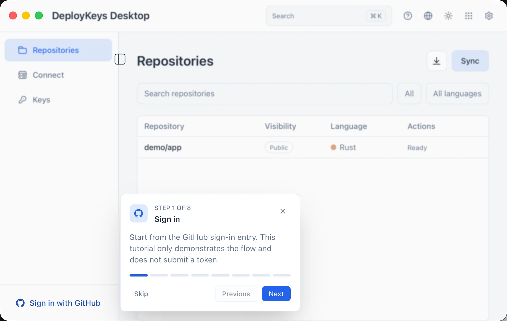
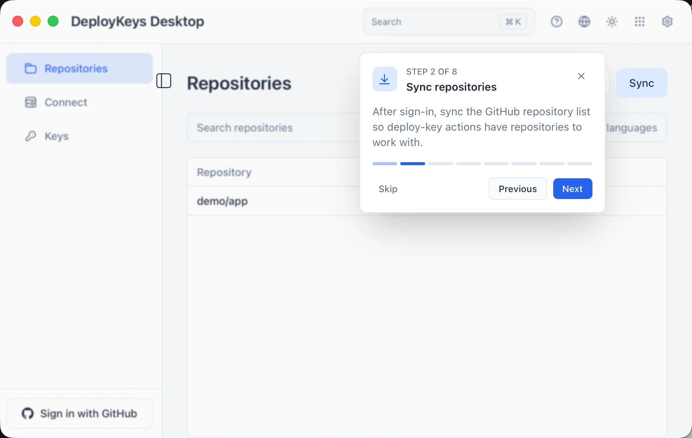
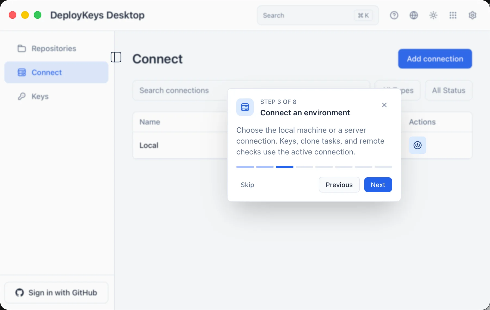
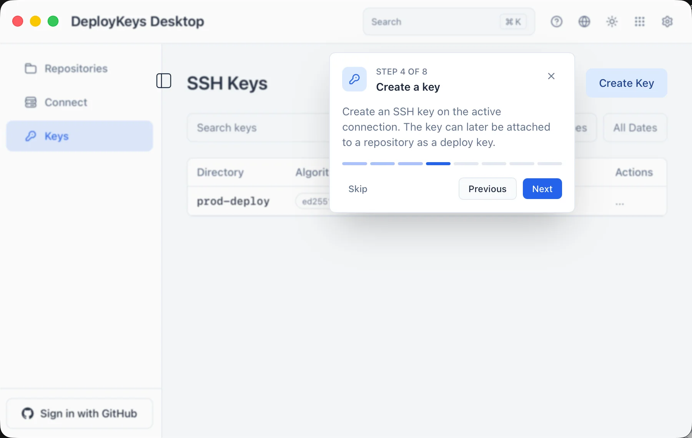
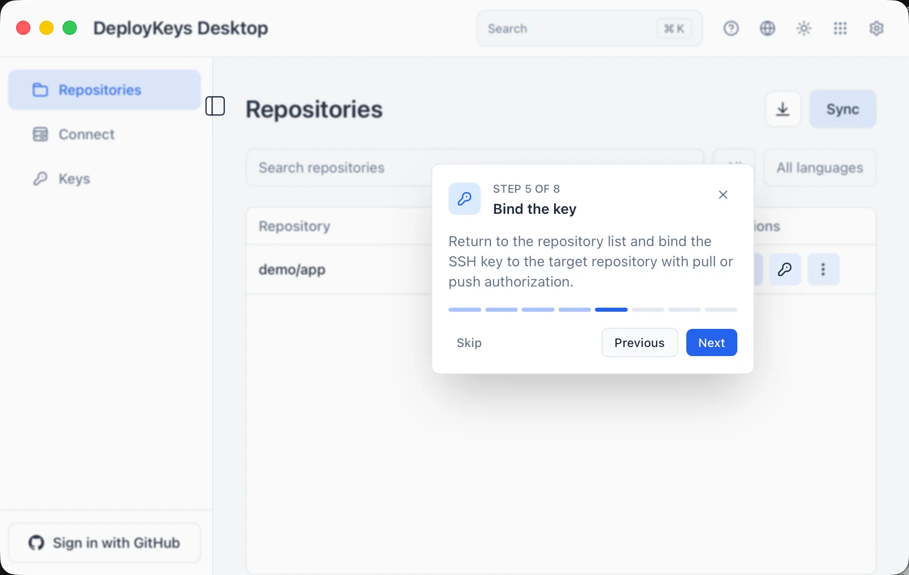
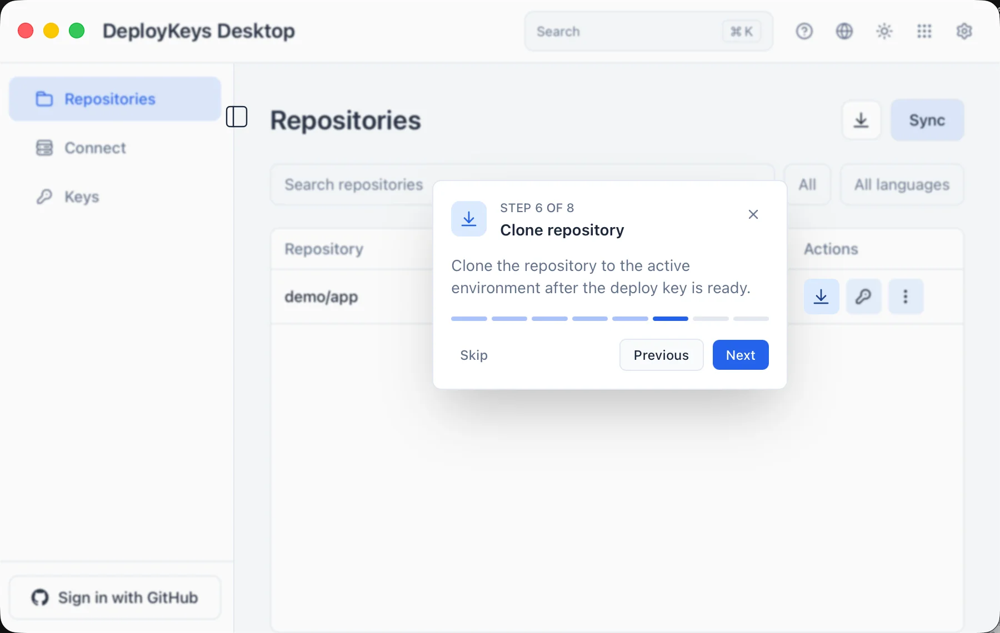
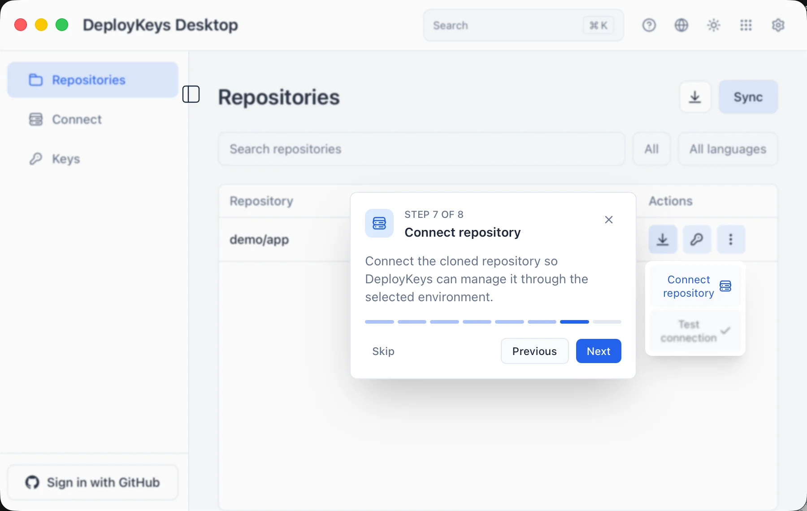
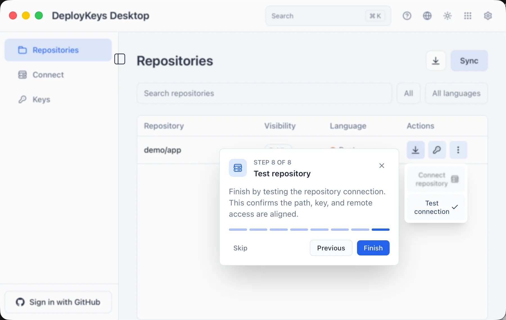
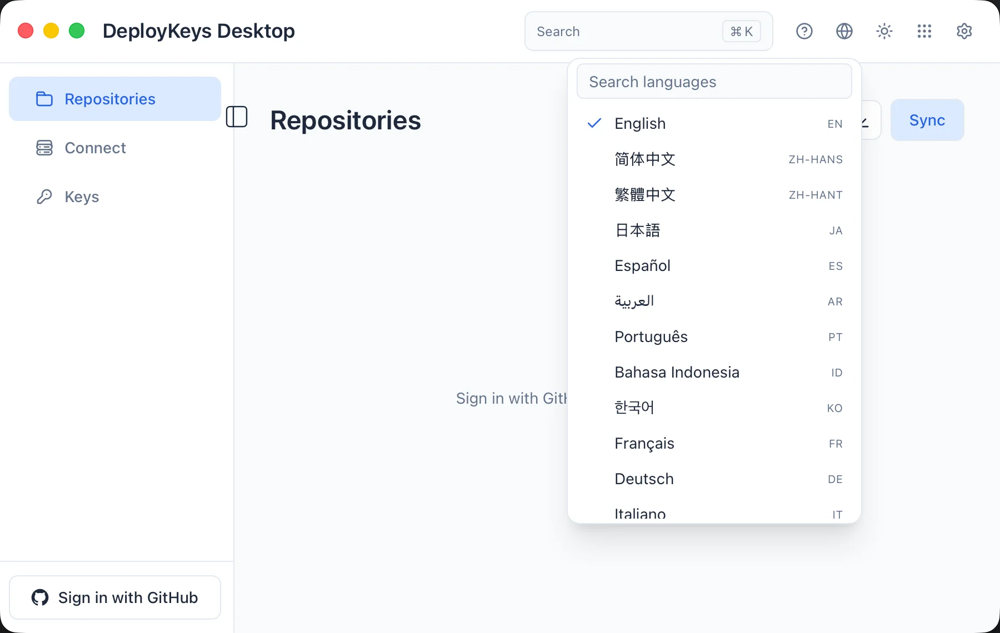

<h1 align="center">DeployKeys Desktop</h1>

<p align="center">
  English | <a href="README-zh-CN.md">简体中文</a>
</p>

<p align="center">
  <a href="LICENSE"></a>
  <a href="https://www.rust-lang.org"></a>
</p>

DeployKeys Desktop is a desktop manager for GitHub Deploy Keys. It is built around target environments: you can generate SSH keys on your local machine or a remote server, bind public keys to GitHub repositories, then clone, connect remotes, and test access from the same environment.

The project is composed of a Rust native core, a Tauri 2 desktop host, and a Leptos/wasm frontend. Its goal is to make Deploy Key ownership, private-key location, repository binding, and access verification clear across multiple repositories and deployment targets.

## Related pages

### Help










### language



## Features

### GitHub Account And Repository Sync

- Sign in with a GitHub fine-grained Personal Access Token.
- Validate the token through GitHub `/user` and persist only the credential reference locally.
- Sync repositories available to the signed-in account.
- Search, filter by visibility/language, paginate, and refresh repository rows.

### Target Environment Management

- Built-in local machine connection.
- Add remote SSH server connections.
- Authenticate remote servers with a password or SSH private key.
- Test remote connections and confirm that `ssh-keygen` is available.
- Edit or delete remote connection records.
- The active connection controls where key, clone, and repository test operations run.

### SSH Key Management

- Generate SSH key pairs on the active environment.
- Local keys are generated natively; remote keys are generated by `ssh-keygen` on the target server.
- The current UI supports Ed25519, RSA 2048, and RSA 4096. Ed25519 is recommended.
- Private keys stay in the target environment. Remote private keys are not copied back to the local machine.
- Search, filter by algorithm/date, sort, and paginate key rows.
- Copy public keys, edit directory/remark fields, and delete key records plus files.
- The default local key directory is `~/.ssh/deploykeys`; it can be changed in Settings. Existing keys are not moved automatically.

### Deploy Key Binding And Repository Operations

- Bind an existing SSH public key as a GitHub Deploy Key for a repository.
- Choose Pull or Push authorization. Pull is recommended for deployment-only usage.
- Write a dedicated SSH config host alias for each managed repository, avoiding global `github.com` SSH config changes.
- Clone repositories to the local machine or a remote server.
- Persist clone tasks and inspect status plus terminal output logs.
- Connect a cloned repository remote to the DeployKeys-managed SSH host alias.
- Test repository SSH access to verify that path, private key, and GitHub Deploy Key are aligned.

### Settings, UX, And Internationalization

- System, light, and dark themes.
- Searchable command palette.
- Beginner tutorial flow.
- Shared page-size setting for repository, connection, and key tables.
- 31 built-in UI languages with runtime switching.
- Arabic switches the document to RTL; all other languages use LTR.

## Security Model

- Release builds use the system credential store by default:
  - macOS: Keychain
  - Linux: Secret Service / libsecret
  - Windows: Windows Credential Manager
- SQLite stores only token/password reference keys, not plaintext GitHub tokens.
- Debug builds use a file-backed credential store by default to avoid repeated OS credential prompts from ad-hoc development signatures. Set `DEPLOYKEYS_CREDENTIALS_BACKEND=keychain` to force the system credential store.
- Remote server passwords are stored through the credential backend. SSH-key authentication stores only the private-key file path.
- Private keys generated on remote targets stay on those servers.
- Local private-key directories are set to `0700` when possible, and private key files are written with restricted permissions.
- The app writes only its own managed SSH config blocks. It does not take over `~/.ssh/config` or `~/.gitconfig`.
- Log sanitization masks GitHub tokens, auth headers, JSON token fields, and common password fields.

## GitHub Token Permissions

The sign-in flow uses a fine-grained Personal Access Token. Recommended token settings:

- Resource owner: choose your personal account or organization.
- Repository access: select the repositories whose Deploy Keys you need to manage.
- Permissions:
  - Administration: Read and write
  - Metadata: Read

`Administration: Read and write` is required to create and manage repository Deploy Keys. `Metadata: Read` is required to read repository metadata.

## Requirements

- Rust 1.75+
- macOS 10.15+, Linux x86_64/arm64, or Windows 10/11 x64
- Git and OpenSSH client
- `sqlite3` CLI for the SQLx compile-time check database
- `wasm32-unknown-unknown` target
- Trunk
- Tauri CLI v2
- A POSIX shell such as Git Bash/MSYS when using the bundled Tailwind installer
  or `make` targets on Windows

Remote servers used for key generation or clone operations also need:

- SSH access
- `ssh-keygen`
- `git`
- SSH access to GitHub

## Quick Start

```bash
git clone <repository-url>
cd deploykeys-desktop

rustup target add wasm32-unknown-unknown
cargo install trunk
cargo install tauri-cli --version "^2"

# Install the standalone Tailwind CLI. Skip this if tools/tailwindcss exists and verifies.
tools/install-tailwind.sh

# Create the SQLx compile-time check database. Copies .env.example to .env if needed.
make db-setup

# Start the Tauri + Trunk development app.
make run
```

Tauri starts the Trunk dev server from `crates/deploykeys-ui` and opens the desktop window. The frontend dev server defaults to port `8000`.

On Windows, run the shell-based setup commands from Git Bash/MSYS, or run the
equivalent `cargo` and `trunk` commands directly from PowerShell after installing
the Tailwind CLI into `tools/tailwindcss.exe`.

## Common Commands

```bash
make run        # Start the development desktop app
make build      # Bundle the release desktop app
make dev        # Build native crates without building the wasm UI
make ui-build   # Build the Leptos/wasm frontend with Trunk
make test       # Run native crate tests
make fmt        # Format code
make clippy     # Run Clippy with warnings denied
make check      # fmt + clippy + test
make audit      # Run cargo audit
make db-setup   # Recreate deploykeys.db for SQLx compile-time checks
make db-clean   # Remove the SQLx compile-time check database
make watch      # Native crate clippy/test watch loop
```

## Project Structure

```text
deploykeys-desktop/
|-- crates/
|   |-- deploykeys-core/      # Core logic: GitHub, database, keys, targets, SSH
|   |-- deploykeys-app/       # Tauri 2 native host and IPC commands
|   `-- deploykeys-ui/        # Leptos CSR frontend built to wasm by Trunk
|-- migrations/               # SQLite migrations
|-- tools/                    # Tailwind standalone CLI installer
|-- Makefile                  # Local development commands
|-- README.md                 # English documentation
`-- README-zh-CN.md           # Simplified Chinese documentation
```

The root workspace `default-members` contains only `deploykeys-core` and `deploykeys-app`. Running `cargo build` or `cargo test` at the repository root therefore builds/tests only native crates. The wasm-only UI crate is built through Trunk/Tauri.

## Architecture

- `deploykeys-core` has no UI dependency. It owns the database, GitHub API access, credential storage, key generation, remote SSH commands, Deploy Key binding, and verification logic.
- `deploykeys-app` opens the SQLite database in the app data directory, runs migrations, and exposes Tauri IPC commands to the frontend.
- `deploykeys-ui` is a Leptos CSR app. It calls IPC DTOs and does not directly access core models or secrets.
- Sensitive data such as keys, tokens, and remote passwords is not sent to the webview. The frontend receives only display-oriented fields.

## Data Location

The runtime database lives under the system app data directory at `deploykeys/deploykeys.db`.

In debug builds, the default file-backed credential backend stores plaintext credentials in `dev_credentials.json` under the same data directory. This is for development convenience only. Release builds use the system credential store by default.

## Internationalization

Translations live in `crates/deploykeys-ui/src/i18n.rs`. English is the baseline locale, and missing keys fall back to English. Tests enforce that every language exposes the exact same key set as English.

To add a language:

1. Add a `Locale` variant and `Locale::ALL` metadata.
2. Add a translation table with the same keys as `EN`.
3. Wire it into `lookup()` and the test helper.

Validate i18n key parity with:

```bash
cargo test -p deploykeys-ui --bin deploykeys-ui i18n::
```

## Community

Thanks to the [LINUX DO](https://linux.do/) community for providing a platform for communication and sharing.

## License

This project is licensed under the MIT License. See [LICENSE](LICENSE) for details.
